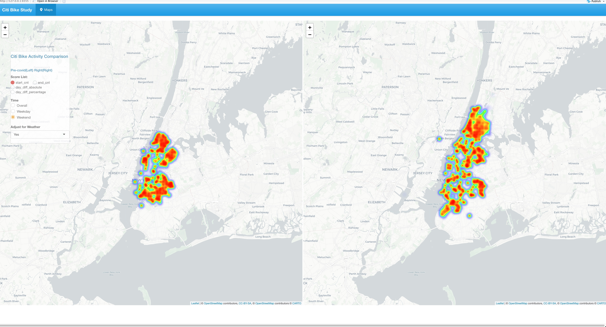

# Project 2: Shiny App Development

### [Project Description](doc/project2_desc.md)

Term: Fall 2023



In this second project of GR5243 Applied Data Science, we develop a *Exploratory Data Analysis and Visualization* shiny app using one of **the OpenFEMA data sets** of your choice. See [Project 2 Description](doc/project2_desc.md) for more details.  

The **learning goals** for this project is:

- business intelligence for data science
- data cleaning
- data visualization
- systems development/design life cycle
- shiny app/shiny server

*The above general statement about project 2 can be removed once you are finished with your project. It is optional.

## Project Title Lorem ipsum dolor sit amet
Term: Fall 2023

+ Team #
+ **Projec title**: + Team members
	+ Hannah Gao (hg2623)
	+ Han Wang (hw2912)
	+ Shaohuan Wu (sw3835)
	+ Jason Cho (yc4076)
	+ Manan Brahmbhatt (mb4984)

+ **Project summary**: Our analysis offers temporal and geospatial insights for various types of disasters. With this app, insurance companies would be able to tailor premiums based on historical and regional risks, while real estate developers can make informed investment decisions. The tourism sector can strategically plan and deploy their programs, while individual businesses can fortify or reduce supply chains according to the disaster trends offered by our analysis. Not only does the analysis aid the preparatory measures, but also unveils new market opportunities. For example, tech companies can innovate disaster-centric solutions, and healthcare sectors could preemptively stock essential supplies.

+ **Contribution statement**: ([default](doc/a_note_on_contributions.md)) All team members contributed equally in all stages of this project. All team members approve our work presented in this GitHub repository including this contributions statement.
+ Shaohuan Wu worked on data retrieval and cleansing. Jason Cho and Manan Brahmbhatt worked on the analysis of disaster data by time. Hannah Gao and Han Wang worked on the geospatial analysis of disaster data. Shaohuan and Manan worked on final Shiny App updates.

Following [suggestions](http://nicercode.github.io/blog/2013-04-05-projects/) by [RICH FITZJOHN](http://nicercode.github.io/about/#Team) (@richfitz). This folder is orgarnized as follows.

```
proj/
├── app/
├── lib/
├── data/
├── doc/
└── output/
```

Please see each subfolder for a README file.

